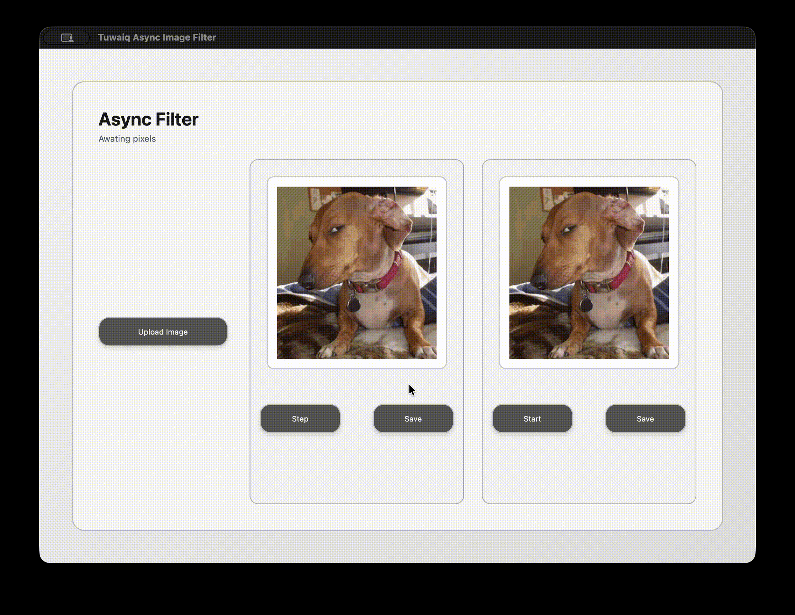

# ⏳🖼️ Async Filter – Awaiting Pixels

A small, focused **macOS desktop app** built with **.NET MAUI (.NET 8)**.  
It plays with images, pixels, and asynchronous processing — I'll be honest with you, it's gonna make the images ugly but it's a necessary sacrifice! Later I will figure out what are we sacrificing them for.



## 🧩 Requirements

- macOS
- .NET 8 SDK
- .NET MAUI workload

## ▶️ How to Run

From the project directory (point the CLI at the solution file so MSBuild knows which project to run):

```bash
dotnet restore tuwaiq-async-image-filter.sln
dotnet build tuwaiq-async-image-filter.sln -t:Run -f net8.0-maccatalyst
```

A native macOS window will launch.

## ✨ What This App Does

- 📂 Upload an image from your computer
- 🖼️ Display the image **twice** (left and right)
- 🎛️ Apply **random pixel-based filters**
- ⏱️ Demonstrate async work in two styles:
  - Step-by-step
  - Continuous (until you stop it)
- 💾 Save the processed images

## 🧭 Layout Overview

- **Upload Image** button at the left
- Two image panels side by side

### Left Panel

- Image preview
- **Step** button
  - Applies **one** random filter asynchronously
- **Save** button

### Right Panel

- Image preview
- **Start / Stop** button
  - Continuously applies filters asynchronously
- **Save** button

Each side works independently.

## ⚙️ Async Behavior (The Main Idea)

- Uses **async / await**
- Never blocks the UI thread
- Shows loading feedback when work isn’t instant
- Continuous filtering runs in the background
- Stop means _actually stop_

## 📁 Project Structure

```text
/AsyncFilter
├── App.xaml
├── MainPage.xaml
├── MainPage.xaml.cs
├── AsyncFilter.csproj
```

- UI is written in **XAML**
- Logic lives in code-behind
